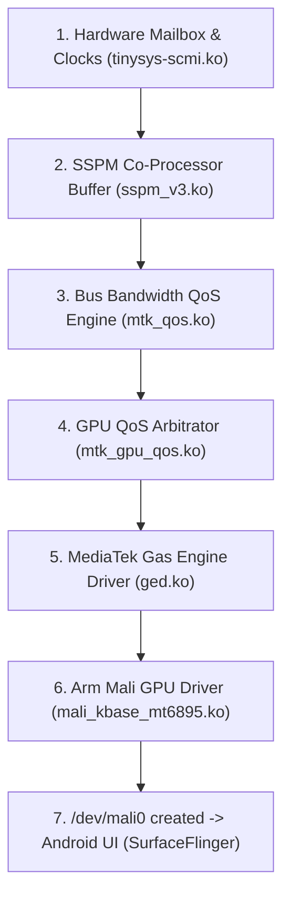

# kernel_xiaomi_mt6895-6.12

> **Porting Status Overview:** See [STATUS.md](STATUS.md).
> **Real Device Milestone (2026-09-28):** **Full Linux 6.12 GKI kernel boots into complete Android 16 userspace on POCO X4 GT / Redmi K50i (`xaga` / `xagain`, Dimensity 8100)**! Verified on physical hardware: `zygote64`, `system_server`, `DisplayManagerService`, `hwcomposer`, and `FBE` userdata decryption are fully active.
> **Mali Valhall GPU Driver Port:** Arm Mali Valhall CSF driver suite (`mali_kbase_mt6895.ko`, `mali_prot_alloc.ko`, `mali_mgm.ko`) ported from MT6895 stock baseline to Linux 6.12 GKI kernel APIs (`vm_flags_set/clear`, `dma_resv` locking, Kbuild out-of-tree build rules) providing `/dev/mali0` for Android 16 SurfaceFlinger hardware acceleration.
> **Microtrust Beanpod TEE 520:** Ported to Linux 6.12 GKI, enabling hardware KeyMint and seamless `/data` encryption/decryption at boot.
> **Fingerprint Update:** Goodix GF3626ZS9 capacitive fingerprint driver ported to standard Linux 6.12 SPI subsystem APIs via PR #4.

---

## Overview

**Android 6.12 Out-of-Tree Kernel Modules Port Tree** for `xaga` (Redmi Note 11T Pro / POCO X4 GT / Redmi K50i, MediaTek Dimensity 8100 / `MT6895`):

- **Base Tree:** OPPO 6.12 MediaTek module tree (`kernel_device_modules-6.12`, Kleaf/mgk build model)
- **Porting Source:** Xiaomi 5.10 ESK kernel (`../baselines/kernel/kernel_xiaomi_mt6895`, `16.2-rebase`) & official 5.10 kernel (`xaga-s-oss`)
- **Kernel Version:** Linux 6.12 (GKI Common + MTK mgk rules)
- **Paired Kernel Source:** OPPO 6.12 Kernel Base (`../android_kernel_oddo_mt6895`, version 6.12.23)

---

## Directory Structure

- `kernel_device_modules-6.12/` — Main module tree (Kleaf/BUILD.bazel + Kbuild dual build paths)
- `STATUS.md` — Porting status overview (progress, build steps, known gaps, next steps)
- `BRINGUP.md` — Bring-up guide (build recipes, power-on sequences, charging/display/touch alignment)
- `xaga-drm-restore.md` — MTK DRM dependency chain recovery guide
- `xaga-log-capture.md` — Log capture methods (XAGR ring buffer, expdb dumping, panic debugging)
- `README.md` — This file (repository overview, ported components, known gaps)

---

## Upstream References

Portions of this codebase originate from the following public repositories:

- **[XagaForge/android_kernel_xiaomi_mt6895](https://github.com/XagaForge/android_kernel_xiaomi_mt6895)** (Community GKI 5.10 kernel for xaga) — Source for board DTS and Xiaomi drivers (`panel-l16`, touch, charger, haptics OOT drivers).
- **[ramabondanp/alps-kernel_device_modules-6.12](https://github.com/ramabondanp/alps-kernel_device_modules-6.12)** (MTK ALPS 6.12 OOT module tree) — Reference for MTK platform modules, DRM dependency chains, and `BUILD.bazel`/`mgk_64.bzl` mappings.

Other base sources: OPPO 6.12 kernel and module trees (`android_kernel_oddo_mt6895`), official Xiaomi 5.10 kernel base, and LineageOS xaga source.

---

## Building

This tree can be built locally using `./build.sh` or automatically in the cloud via **GitHub Actions** (`.github/workflows/ci-build.yml`).

### One-Click Build & Packaging: `./build.sh`

In a complete workspace containing the paired kernel (`../android_kernel_oddo_mt6895`), `build.sh` executes the full compile and packaging flow:

1. **Config:** `gki_defconfig` + `mgk_64_k612_defconfig` + `vendor/xaga.config`
2. **Kernel Image:** `Image` + `Image.gz` (gzip)
3. **In-tree Modules:** Generates/refreshes `Module.symvers`
4. **Out-of-Tree Modules:** Compiles **200+ `.ko` modules** (`make M=`)
5. **DTS Compilation:** `mt6895.dtb` (SoC base) + `xaga.dtbo` / `xaga_global.dtbo` (verified via `fdtoverlay`)
6. **Images Packed:**
   - `images/out/boot_new.img` — `magiskboot -n`: `Image.gz` kernel + KernelSU
   - `images/out/vendor_boot_new.img` — `mkbootimg`: official vendor ramdisk populated with 6.12 `.ko` modules (stripped via `llvm-strip --strip-debug` to ~25MB) + rebuilt `modules.load`/`modules.dep`
   - `images/out/dtbo_new.img` — DTOv1 format

```bash
./build.sh                        # Default: Full compilation + packaging (outputs to images/out/)
./build.sh --modules-only         # Compile kernel modules only (200+ .ko files), no boot packaging
./build.sh --no-clean             # Incremental compilation (does not clean previous objects)
./build.sh --skip=BOOT,VENDOR     # Compile but skip specific image packaging steps
./build.sh --help
```

### Environment Overrides:
- `K`: Path to base 6.12 kernel tree (`android_kernel_oddo_mt6895`)
- `M`: Path to modules tree (`./kernel_device_modules-6.12`)
- `LLVM_PREFIX`: Path to AOSP Clang toolchain (e.g., `$HOME/clang`, **AOSP clang-r536225** recommended)
- `JOBS`: Number of parallel compile jobs (defaults to `nproc`)

---

## Ported Components (from 5.10 Baselines)

All drivers are registered in Kleaf's `kernel/kleaf/mgk_64.bzl` and `BUILD.bazel`:

| Module | Description |
|---|---|
| **goodix_cap** | Goodix GF3626ZS9 capacitive fingerprint driver (ported to Linux 6.12 SPI APIs) |
| **simtray** | SIM tray status detection |
| **hwid** | `/sys/hwid` hardware board identification |
| **xiaomi_touch + double_click** | Xiaomi touch framework + double-tap-to-wake |
| **NVT36672C** | Novatek SPI touchscreen (adapted for Linux 6.12) |
| **aw8697 haptic** | Awinic linear haptic motor |
| **leds-ktz8863a + panel-l16 (x2)** | Backlight controller + dual L16 DSC display panels with ESD recovery |
| **ln8000 / sc8551 / sc8561 / bq28z610** | Dual charge pump ICs + battery fuel gauge (`bms` power supply) |
| **pd_cp_manager + Charging Framework** | Complete `mtk_charger`/`mtk_pd_*` suite (`mtk-master-charger` alignment) |
| **6x Camera Sensors** | `s5khm2`, `s5k4h7`, `ov16a1`, `s5kgw1`, `gc02m1`, `ov02b10` (`src-v4l2`) |
| **KTD2687 Flashlight** | Dual-LED camera flash driver + core flashlight subsystem wiring |
| **MTK Pump Express** | `pep`/`pep20`/`pep40`/`pep45`/`pep50`/`pep50p` fast charging protocols |
| **MTK Platform Modules (123 ko)** | Complete platform module suite synchronized from ALPS tree |
| **MTK DRM Subsystem (60+ modules)** | `mediatek_v2` (80+ files), `mml`, `gpufreq v2`, `slbc`, `system_heap`, `mmdvfs`, `vmm` (0 undefined symbols) |
| **Microtrust Beanpod TEE 520 (`isee`)** | Beanpod KeyMint & Userdata Decryption driver ported to Linux 6.12 GKI |
| **Mali Valhall GPU (`mali_kbase_mt6895`, `mali_prot_alloc`, `mali_mgm`)** | Dimensity 8100 Mali-G610 MC6 CSF driver ported to Linux 6.12 GKI with MT6895 DVFS, power management, and Android 16 HAL compatibility (`r32p1-01eac0`) |

### Mali Valhall CSF GPU Driver Architecture (Linux 6.12 GKI)
- **CSF Backend:** Direct Command Stream Frontend (`MALI_USE_CSF=1`) hardware scheduler support for Valhall architecture (Mali-G610 MC6 / Dimensity 8100).
- **VMA & Memory Subsystem:** Converted memory allocations to Linux 6.12 `vm_flags_set()` and `vm_flags_clear()`, with `dma_resv_lock()` wrapped around DMA-BUF attachments. Migrated VMA unmapped area lookups in `thirdparty/mali_kbase_mmap.c` to native `current->mm->get_unmapped_area()` under Linux 6.1+ Maple Tree (`mm_mt`).
- **Kernel MM & Driver Core Modernization:** Adapted user page pinning (`pin_user_pages_remote`, `pin_user_pages`), eliminated removed `__GFP_ATOMIC` flag references, handled per-process RSS tracking for 6.2+ `percpu_counter rss_stat`, safely guarded removed `register_shrinker()` APIs, hardened `kthread_create()` against format-security warnings, updated `dev_pm_opp_set_regulators()` to NULL-terminated arrays with token tracking, adapted `dma_set_max_seg_size()` for Linux 6.6+ `void` return semantics, and provided `strlcpy` compatibility helper for Linux 6.8+ GKI.
- **Power Management & DVFS:** Linked with MediaTek `gpufreq_v2` using `GPU_PWR_ON` and `GPU_PWR_OFF` state transitions, asynchronous power callbacks, and MTCMOS/SPM integration.
- **Allocation & Dependency Order:** Automated `modules.dep` sequencing ensuring `mali_prot_alloc.ko`, `mali_mgm.ko`, `mtk_gpufreq_wrapper.ko`, `mtk_gpufreq_mt6895.ko`, `gpu_bm.ko`, and `ged.ko` initialize before `mali_kbase_mt6895.ko` to create `/dev/mali0`.

---

## Hardware ⟷ Kernel Driver ⟷ Firmware Map (Dimensity 8100 / MT6895)

On MediaTek platforms, the GPU does not operate in isolation—it is part of a tightly coupled co-processor ecosystem managed via firmware mailboxes, interconnect QoS, and real-time power arbiters.

| Hardware Block | Physical Hardware Role | Kernel Modules / Drivers | Firmware / Interface |
| :--- | :--- | :--- | :--- |
| **Arm Mali-G610 MC6** | GPU 3D rendering, compute engines, job queues, shader cores | `mali_kbase_mt6895.ko`<br>`mali_mgm.ko`<br>`mali_prot_alloc.ko` | Direct MMIO registers + IRQ lines mapped in `xaga-mt6895.dtsi` |
| **SSPM** *(Smart System Power Manager)* | Dedicated **Cortex-M4** hardware co-processor managing real-time low-power states, DRAM bandwidth limits, and GPU frequency bounding | `tinysys-scmi.ko`<br>`sspm_v3.ko`<br>`mtk_tinysys_ipi.ko` | **`sspm.img`**<br>Communicates via ARM SCMI mailbox and shared SYSRAM buffer |
| **GPUEB** *(GPU Event Bus)* | Hardware performance counter bus monitoring GPU frame execution time, load bursts, and thermal output | `mtk_gpueb.ko`<br>`ged.ko` (`src/ged_eb.c`) | Direct interconnect bus registers |
| **DVFSRC & MT6315 PMIC** | Hardware Dynamic Voltage/Frequency Scaling Resource Collector + Buck Regulator for `V_GPU` power rails | `mtk-dvfsrc*.ko`<br>`mtk_gpufreq_mt6895.ko`<br>`mtk_gpu_hal.ko` | Controls `VGPU_DVFS` and `VGPU_SRAM` power domains |
| **EMI / SMI** *(Ext. Memory Interface & Smart Multimedia Interface)* | LPDDR5 memory controller, QoS bus arbitration, memory bandwidth throttling | `mtk_qos.ko`<br>`mtk_gpu_qos.ko`<br>`gpu_bm.c` | Shares bandwidth tables with SSPM over SCMI (`qos_ipi_to_sspm_scmi_command`) |
| **MTK IOMMU & EMI MPU** | Address translation (MMU-500) and hardware memory firewall protecting GPU buffers and DRM secure memory | `mtk_iommu.ko`<br>`emimpu.ko`<br>`system_heap.ko` | Hardware Translation Lookaside Buffers (TLB) |
| **Gas Engine / Orchestration** | MediaTek proprietary user-space $\leftrightarrow$ kernel arbitration layer (FPSGO, frame fence sync, thermal back-off) | `ged.ko` | `/dev/ged` interface exposed to Android `SurfaceFlinger` and `libGLES_mali.so` |

### Deterministic Initialization Sequence



---

## Project Status

### ✅ Completed

| Item | Details |
|------|---------|
| **200+ Kernel Modules** | All OOT modules compile clean (`-Werror`), 0 undefined symbols |
| **CI/CD Pipeline** | GitHub Actions: automated cloud compilation on every push |
| **Full Kernel Packaging** | CI supports full `Image.gz` + flashable `boot.img`/`vendor_boot.img`/`dtbo.img` packaging |
| **Fingerprint Driver** | Goodix GF3626ZS9 ported to Linux 6.12 standard SPI APIs (PR #4, merged) |
| **Display DRM Handoff** | Early boot display pipeline fix — MTCMOS power-on ordering + DSI clock preparation |
| **Vendor Firmware Staging** | `vendor_firmware/` directory structure + `build.sh` auto-staging for `gz`/`tee`/`sspm`/`mcupm`/`pi_img` |
| **Recovery Boot** | Verified on real hardware: boots into recovery with working display |
| **UFS Power Stability** | `mt6363_vufs12` & `mt6363_vufs18` configured `regulator-always-on`, eliminating all I/O errors |
| **Full Android 16 Userspace Boot** | Verified on physical device: boots Android 16, decrypts FBE `/data`, runs `zygote64`, `system_server`, `DisplayManagerService`, and `hwcomposer` |
| **Mali Valhall Driver Port** | `mali_kbase_mt6895.ko`, `mali_prot_alloc.ko`, `mali_mgm.ko` ported to Linux 6.12 GKI with MT6895 platform wiring |
| **Android 16 VABC Ramdisk** | Upgraded base boot asset from Android 12 GSI to native Android 16 with `snapuserd` (Closes #7) |
| **Camera Sensor Build Rules** | 6 xaga camera sensor drivers registered in Kbuild & Bazel build systems (Closes #6) |
| **Documentation** | Fully translated to English (`STATUS.md`, `BRINGUP.md`, `xaga-drm-restore.md`, `xaga-log-capture.md`) |

### 🔧 Remaining Gaps

| # | Gap | Severity | Notes |
|---|-----|----------|-------|
| 1 | **Mali GPU User-Space Binding** | In progress | Verified kernel side; testing SurfaceFlinger EGL initial handshake with `/dev/mali0` |
| 2 | **Fingerprint TEE daemon** | Non-blocking | `goodix_cap` kernel driver is ported; needs matching TEE user-space daemon + real hardware testing |
| 3 | **Touchscreen Firmware** | Needs device | `nt36672c` firmware binary must be placed in `/vendor/firmware` partition |
| 4 | **DTS Makefile Registration** | Needs user env | DTBO list must be registered in `kernel/build` mgk rules (not possible in this tree alone) |

### 🗺️ Next Steps

1. **Real device Android boot** — Integrate proprietary vendor blobs (TEE/GZ/SSPM/MCUPM firmware + vendor HAL binaries) and test full system boot beyond recovery
2. **DSI re-init closure** — Complete "LK replica" display pipeline for cases where LK doesn't initialize DSI (MTCMOS → engine start → mutex/path config → FRAME_DONE)
3. **KernelSU integration** — Add KernelSU module to the CI build pipeline for root support
4. **User environment integration** — Register `xaga` in mgk DTBO rules, merge `vendor/mediatek` siblings, append 6 camera sensor names
5. **Functional validation** — Module load chain verified (200+ ko, 707ms); next: `/sys/class/power_supply/` → charger → PD fast charging verification

---

## License

Kernel and modules are licensed under the GNU General Public License (GPL) as declared in their respective source files.
